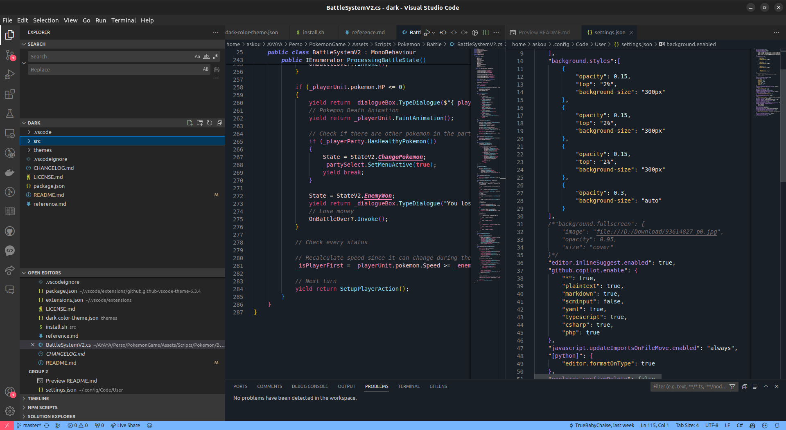

# Shade Of Love

## Preview

## About

This is a simple VSCode theme that I created for my personal use. It is a dark theme with a shade of pink, red and blue. I hope you like it! If you have any suggestions or feedback, feel free to create an issue or pull request.

## LICENSE

This theme is licensed under the MIT License. See the [LICENSE](https://raw.githubusercontent.com/TrueBabyChaise/Serena-Dark-Theme/master/LICENSE.md) file for more information.

**Enjoy!**
